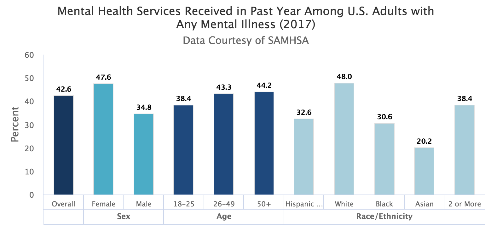

# AccessHealth

## Background of the Issue:
According to the [World Health Organization](https://www.who.int/en/news-room/fact-sheets/detail/mental-health-strengthening-our-response
):

  *"Mental health is a state of well-being in which an individual realizes his or her own abilities, can cope with the normal stresses of life, can work productively and is able to make a contribution to his or her community.

  Mental health is fundamental to our collective and individual ability as humans to think, emote, interact with each other, earn a living and enjoy life. On this basis, the promotion, protection and restoration of mental health can be regarded as a vital concern of individuals, communities and societies throughout the world."*

The [National Institute of Mental Health](https://www.nimh.nih.gov/health/statistics/mental-illness.shtml#part_154787) states that nearly one in five U.S. adults live with a mental illness (46.6 million in 2017).

What are Mental Health Services?

In the [2017 National Survey on Drug Use and Health (NSDUH)](https://www.samhsa.gov/data/sites/default/files/cbhsq-reports/NSDUHDetailedTabs2017/NSDUHDetailedTabs2017.htm#tab8-33A) mental health services is defined as having received inpatient treatment/counseling or outpatient treatment/counseling, or having used prescription medication for problems with emotions, nerves, or mental health.

For the purposes of our app, we will be focusing on the services of Psychologists, Therapists, and Psychiatrists.

## Design Statement:
Our app provides access to mental health services for young professionals (age 18-40) in NYC to whom access to mental health care was previously unavailable.
Our app will also provide medical students the opportunity to fulfill hour requirements of a fellowship program.

## MVP:
- An app that facilitates the connection between a User (patient) and a Doctor who specializes in mental health services.
- The User logs in and is directed to a landing page which contains information about the app and a FAQ section. From a Nav bar, the User has the ability to access a list of doctors and the User's profile page. Within the Doctor's list page, the User can search for a doctor by name, filter by specialization/location/language/etc, and select a Doctor to view its page.

## App Site Map:
- Landing Page
	- About (app/project)
	- FAQ (with descriptions of )
- Navbar
	- Home
	- Doctor List
	- Profile
- Doctor List Page
	- LIST of doctors
	- SEARCH by name
	- FILTER by specialization/location
	- CLICK on doctor ITEM
- Doctor Show Page
	- DETAILS of doctor
	- MESSAGE doctor through textarea
	- CALENDAR (stretch)
- Profile
	- User details
	- Text area to input mental health issue that needs help

## Technologies Used:
- ~~Blockstack~~
- React
- Ruby on Rails

## Implement App
$ npm install
$ npm start
